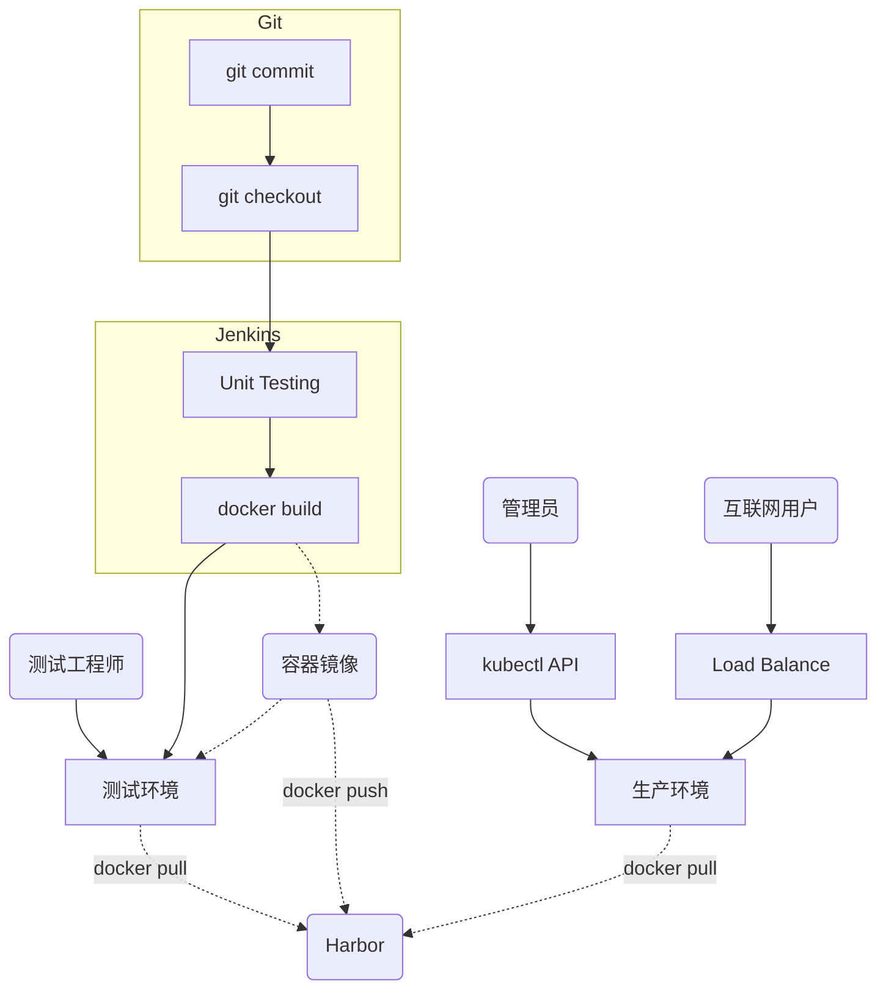

K8S + GitLab + Jenkins自动化发布项目实践（一）

# 发布流程设计


由于之前部署的k8s集群已经升级到v1.24（容器运行时已经修改为containerd），这里我们单独准备一台服务器用于部署Harbor和GitLab。需要安装docker服务。

# 安装Docker服务
```bash
systemctl stop firewalld
systemctl disable firewalld
sed -i 's/enforcing/disabled/' /etc/selinux/config

# 安装docker
yum install -y wget
wget https://mirrors.aliyun.com/docker-ce/linux/centos/docker-ce.repo -O /etc/yum.repos.d/docker-ce.repo
yum -y install docker-ce-18.06.1.ce-3.el7
systemctl enable docker && systemctl start docker
docker --version
```

配置国内容器镜像仓库：
```
cat > /etc/docker/daemon.json << EOF
{
   "registry-mirrors": [
                        "https://b9pmyelo.mirror.aliyuncs.com",
                        "http://hub-mirror.c.163.com/"
                       ],
   "insecure-registries": [
                        "https://b9pmyelo.mirror.aliyuncs.com"
                       ],
   "exec-opts": ["native.cgroupdriver=systemd"]
}
EOF

# 重启docker服务
systemctl restart docker
```

# 部署Harbor作为镜像仓库
本小节我们使用docker-compose来部署Harbor作为镜像仓库。

>:boat:Harbor离线安装包下载地址：https://github.com/goharbor/harbor/releases
>:boat:Harbor部署配置：https://goharbor.io/docs/2.7.0/install-config/
>:boat:docker-compose安装包下载：https://github.com/docker/compose/releases/

准备工作：
```bash
mkdir /opt/harbor && cd /opt/harbor
mv /root/harbor-offline-installer-v2.5.6.tgz /opt/harbor
tar zxvf harbor-offline-installer-v2.5.6.tgz
cd harbor
cp harbor.yml.tmpl harbor.yml 
vi harbor.yml
# -配置hostname为指定IP或者FQDN
# -配置admin用户密码harbor_admin_password
# -先注释https相关配置（生产环境不推荐）

# 安装docker-compose
cp /root/docker-compose-Linux-x86_64 /usr/local/bin/docker-compose
chmod +x /usr/local/bin/docker-compose
docker-compose version
```

部署本地Harbor：
```bash
# 部署Harbor
cd /opt/harbor/harbor
./prepare   # 会生成一个docker-compose.yml
./install.sh  

# 启动Harbor
docker-compose up -d
# 停止Harbor
docker-compose down -v
```

部署完检查：
```bash
# 需要在docker-compose.yml文件同级目录下执行
[root@harborgit harbor]# docker-compose ps
      Name                     Command                       State                          Ports
-----------------------------------------------------------------------------------------------------------------
harbor-core         /harbor/entrypoint.sh            Up (health: starting)
harbor-db           /docker-entrypoint.sh 96 13      Up (health: starting)
harbor-jobservice   /harbor/entrypoint.sh            Up (health: starting)
harbor-log          /bin/sh -c /usr/local/bin/ ...   Up (health: starting)   127.0.0.1:1514->10514/tcp
harbor-portal       nginx -g daemon off;             Up (health: starting)
nginx               nginx -g daemon off;             Up (health: starting)   0.0.0.0:80->8080/tcp,:::80->8080/tcp
redis               redis-server /etc/redis.conf     Up (health: starting)
registry            /home/harbor/entrypoint.sh       Up (health: starting)
registryctl         /home/harbor/start.sh            Up (health: starting)
```

部署完成后，可以直接浏览器访问上面配置的`hostname`打开Harbor前端页面，使用`admin`用户登录。


# 部署GitLab作为代码仓库
>:star:官方地址：https://about.gitlab.com/install/#official-linux-package

使用docker部署GitLab：
```bash
mkdir /opt/gitlab
echo 'export GITLAB_HOME=/opt/gitlab' >> /root/.bash_profile
source /root/.bash_profile

# 容器部署giltab（镜像名称放到最后）
docker run --detach --hostname gitlab.demo.com \
  --publish 443:443 --publish 88:80 --publish 2222:22 \
  --name gitlab --restart always \
  --volume $GITLAB_HOME/config:/etc/gitlab \
  --volume $GITLAB_HOME/logs:/var/log/gitlab \
  --volume $GITLAB_HOME/data:/var/opt/gitlab \
  gitlab/gitlab-ce
```

取决于镜像拉取的速度，部署完成大概需要3到5分钟。检查部署状态：
```bash
[root@harborgit harbor]# docker ps
CONTAINER ID        IMAGE                                COMMAND                  CREATED             STATUS                    PORTS                                                            NAMES
c0795ec3b34e        gitlab/gitlab-ce                     "/assets/wrapper"        5 minutes ago       Up 5 minutes (healthy)    0.0.0.0:443->443/tcp, 0.0.0.0:2222->22/tcp, 0.0.0.0:88->80/tcp   gitlab
3fa9ce8ec05d        goharbor/nginx-photon:v2.5.6         "nginx -g 'daemon of…"   14 minutes ago      Up 14 minutes (healthy)   0.0.0.0:80->8080/tcp                                             nginx
07f156592a2f        goharbor/harbor-jobservice:v2.5.6    "/harbor/entrypoint.…"   14 minutes ago      Up 14 minutes (healthy)                                                                    harbor-jobservice
3cfdec233a2c        goharbor/harbor-core:v2.5.6          "/harbor/entrypoint.…"   14 minutes ago      Up 14 minutes (healthy)                                                                    harbor-core
b3ae94a48b85        goharbor/harbor-registryctl:v2.5.6   "/home/harbor/start.…"   15 minutes ago      Up 14 minutes (healthy)                                                                    registryctl
00e7fc671a26        goharbor/registry-photon:v2.5.6      "/home/harbor/entryp…"   15 minutes ago      Up 14 minutes (healthy)                                                                    registry
b84e56987d36        goharbor/harbor-db:v2.5.6            "/docker-entrypoint.…"   15 minutes ago      Up 14 minutes (healthy)                                                                    harbor-db
faf6f9d624cb        goharbor/redis-photon:v2.5.6         "redis-server /etc/r…"   15 minutes ago      Up 14 minutes (healthy)                                                                    redis
f913b1c4c27c        goharbor/harbor-portal:v2.5.6        "nginx -g 'daemon of…"   15 minutes ago      Up 14 minutes (healthy)                                                                    harbor-portal
f964a7a7492a        goharbor/harbor-log:v2.5.6           "/bin/sh -c /usr/loc…"   15 minutes ago      Up 15 minutes (healthy)   127.0.0.1:1514->10514/tcp                                        harbor-log

```

部署完成后（容器状态为healthy），访问地址`http://IP:88`即可打开GitLab前端页面。初次登录需要设置`root`管理员用户密码。

获取管理员用户初始密码：
```bash
docker logs <gitlab容器ID> | grep initial_root_password
cat /opt/gitlab/config/initial_root_password
```


## 常用Git命令
```bash
# git全局设置
git config --global user.name "admin"
git config --global user.email "admin@example.com"

# 创建一个新仓库
git clone git@gitlab.demos.com:root/java_demo.git
cd java_demo
touch README.md
git commit -m "add README"
git push -u origin master

# 推送现有文件夹
cd existing_folder
git init
git remote add origin git@gitlab.demos.com:root/java_demo.git
git add .
git commit -m "Initial commit"
git push -u origin master

# 推送现有Git仓库
cd existing_repo
git remote rename origin old-origin
git remote add origin git@gitlab.demos.com:root/java_demo.git
git push -u origin --all
git push -u origin --tags
```


