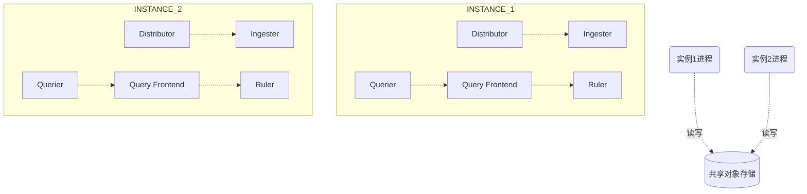
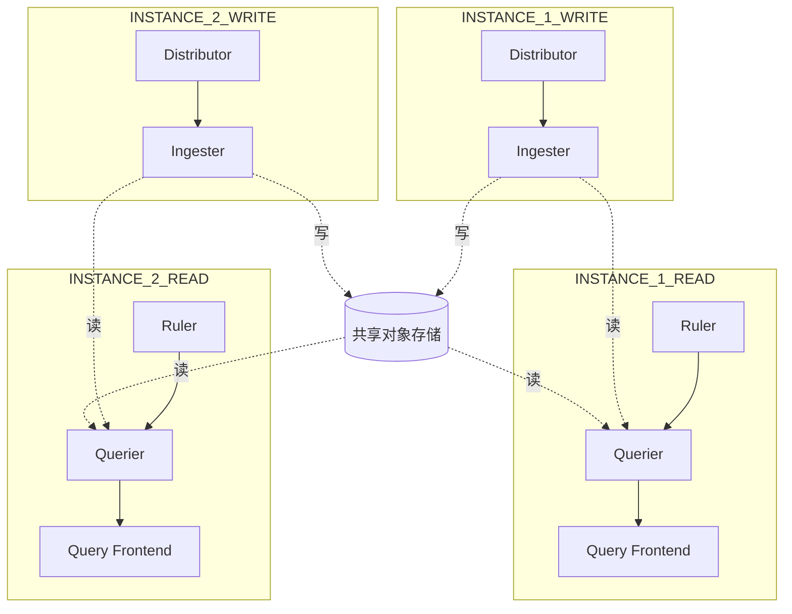

云原生可观测性之Grafana Loki介绍

云原生计算基金会（CNCF）提出了一套云原生可观测性标准协议，称为**OpenTelemetry Protocol**。OpenTelemetry定义了云原生可观测性的三个重要支柱：Log、Metrics、以及Trace。

- **Log**：基于日志的监控 
 日志是以应用程序运行事件为基础的记录。基于日志的监控产品有Elastic Stack、Flume、Graylog、以及Grafana Loki。

- **Metrics**：基于指标的监控 
 指标是可聚合的数据。这些数据可以来自于基础系统、主机、第三方源等等。基于指标的监控产品有Prometheus、Elastic Stack、Zabbix、Skywalking、以及Grafana Mimir。

- **Trace**：基于调用链的监控 
 调用链是从头至尾跟踪某一过程的一种行为。这个过程可以是一次 API 调用，也可以是系统内的一个动作。基于调用链的监控产品有Skywalking、Zipkin、PinPoint、以及Grafana Tempo。

Loki是Grafana Labs推出的日志聚合工具。Loki本身不存储日志数据，而是将采集的日志写入到第三方对象存储中（例如Amazon S3、MinIO、BoltDB）。与Elasticsearch不同，Loki只会对**标签**进行索引，而不会对日志数据进行索引，因而能够大大节省存储空间。

# Loki架构

**版本：v2.7**

## Loki部署模式
Loki的部署模式可以通过命令行参数`-target`来指定。

### 单进程模式
默认的部署模式（`-target=all`）。Loki的所有组件都将以二进制形式或容器镜像形式统一运行在一个单独的进程里。

> :smile: 优点：快速部署，适用于小体量的读写场景（每天不超过100GB）。  
> :cry: 缺点：横向扩展只能通过新增实例来实现，无法针对读或写场景单独扩容。

### 简单可扩展模式
简单可扩展模式支持读写分离（`-target=read`和`-target=write`），可以针对读写场景有针对性的扩容。

> :smile: 优点：读写节点分离，可以单独按需扩展读写能力，最高可以支持每天TB级别日志量的场景。  
> :cry: 缺点：需要在Loki前面部署LB，将对`/loki/api/v1/push`的请求流量以轮询方式（round-robin）定向到写节点。

### 微服务模式
微服务部署模式中，Loki的每个组件都将以单独的进程运行。通过target命令行标志指定以下组件：

- ingester
- distributor
- query-frontend
- query-scheduler
- querier
- index-gateway
- ruler
- compactor

> :smile: 优点：以微服务集群形式部署的扩展性好、可观测性高、运行效率高，与Kubernetes搭配使用最佳。  
> :cry: 缺点：部署和运维最为复杂。

## Loki组件
### Distributor
Distributor负责处理客户端以stream形式发来的写请求。Distributor对接收到的日志流数据进行简单的检查后，将它们拆分为多个批量（batch），发送给多个Ingester并行处理。

Distributor本身是**无状态**的。多个distributor组件前面最好部署LB来合理地分配写请求流量。

Distributor的主要功能包括：日志流检查、标签预处理、日志流限速、日志流转发、哈希运算、多数派一致性。

1. Distributor会检查日志流使用的标签（label）是否为有效的Prometheus标签，还会检查日志的时间戳、以及确保日志单行不会过长。

2. Distributor不会修改日志流数据，仅仅对日志流的标签做正则化处理，以及对标签进行排序。这里的正则化处理，是使得`{foo="bar",app="game"}`等价于`{app='game',foo="bar"}`。正则化和排序处理使得Loki能够确定地对等价的标签进行缓存和哈希运算。

3. Distributor支持针对租户对日志流写入进行限速。同一个租户在每个distributor的写入速度上限等于租户写入速度上限除以distributor的数量。租户在单个distributor的写入速度上限会随着distributor的横向扩缩容自动调整。

4. 对日志流做完检查后，distributor会将其转发给ingester。为了避免数据丢失，distributor会将日志流定向给3个ingester（由参数`replication_factor`决定，默认为3）。Distributor通过哈希运算来获取要转发的多个目标ingester。目标ingester中的多数派（`floor(replication/2)+1`）写入成功，日志流才算写入成功。除了多副本写入以外，ingester还通过**WAL**（write ahead log）机制来持久化日志流写入，防止数据丢失。

5. 一个日志流关联一个确定的租户ID和唯一的标签集合（labelset）。Distributor利用日志流对应的**租户ID**和**labelset**来进行哈希运算，以确定要转发的目标ingester。Loki利用存储在Consul中的**哈希环**（hash ring）来实现一致性哈希。每个ingester都会向哈希环注册自己的状态、以及拥有的token集合。如果ingester拥有的token大于日志流的哈希值，就可以作为目标ingester接受写入。

6. 所有的distributor都访问同一个哈希环。为了保证查询的一致性，只有ingester中的多数节点返回确认后，distributor才会向客户端返回成功。

> :sunflower:Loki中的Hash Ring：https://grafana.com/docs/loki/latest/fundamentals/architecture/rings/  
> :sunflower:Loki中使用标签：https://grafana.com/docs/loki/latest/fundamentals/labels/

### Ingester
Ingester组件主要负责将日志数据写入后端长期存储，例如DynamoDB、AWS S3、Cassandra等，同时还负责向读请求返回日志数据到内存中。

Ingester内置一个lifecycler来管理其生命周期。Ingester生命周期中包含以下几种状态：PENDING、JOINING、ACTIVE、LEAVING、UNHEALTHY。Lifecycler特性在较新的版本中已被WAL机制取代。

Ingester对接的每个日志流都会被转化为内存中的多个**Chunk**，在经过一定的interval（可配置参数）后，这些Chunk结构会被落盘持久化。Chunk在以下情况下会被压缩并被标记为只读：

- Chunk达到了容量上限（可配置参数）；

- 距离上次修改Chunk经过了很长的时间；

- Chunk落盘持久化时。

每当有一个Chunk被标记为只读时，就会产生一个可写的新chunk来取代它。如果ingester进程崩溃或者突然退出，还没有落盘的日志数据就会丢失。Loki通过为每个日志流配置多个副本（`replication_factor`）来缓解该风险。

当一个Chunk被持久化到后端存储时，Loki会根据它的**租户**、**标签**、以及**内容**进行哈希运算。正常情况下，这样可以保证同一个日志流的多个ingester副本中只有一个副本的Chunk会被写入到后端存储，避免了空间浪费。但是如果某个副本发生了数据写入失败，导致Chunk的内容不完全一致，就可能导致相同的日志数据被重复落盘。这时就需要用到Querier的去重功能。

Loki可以配置为接受乱序写入。当没有配置接受乱序写入时，Ingester会验证采集的日志行是否有序。每个日志行都包含一个**时间戳**信息。Ingester会丢弃不满足时间戳递增顺序的日志行，并向客户端返回错误信息。如果两条日志具有相同的时间戳，会分为以下两种情况来处理：

- 两条日志的时间戳相同，内容也相同：后接收的日志会被认为是重复内容，直接忽略；

- 两条日志的时间戳相同，但内容不同：后接收的日志会被保留。也就是说此时会存在两条时间戳相同但内容不同的日志。

### Query Frontend
Query前端是一个可选部署的服务，可用于提供Querier的API endpoint，以及加速读操作。部署了Query前端时，所有的读请求应该被重定向到Query前端，而不是直接转发到Querier组件。

Query前端将接收的读请求放入一个内置的队列中。Querier组件则担任类似worker的角色，从队列中拉取任务执行，并将执行结果返回给Query前端。Querier通过配置`querier.frontend-address`来连接到Query前端。

Query前端是**无状态**的。一般情况下，建议部署两个Query前端来实现较好的调度效果。

Query前端的队列机制主要有以下好处：

- 确保因为OOM失败的大查询可以自动重试。

- 支持将大查询拆分为多个并行的小查询，在不同Querier执行后将执行结果汇总。

- 通过队列的FIFO机制，避免多个大查询被分配给同一个Querier处理。

- 利用公平的租户间调度算法，阻止单个租户通过DOS（denial-of-service）攻击其他租户。

### Querier
Querier组件使用Loki的**LogQL**查询语言来处理请求，负责从ingester获取日志、以及从后端长期存储读取日志。

Querier在处理读请求时，会先向ingester查询内存中的日志数据，如果内存中没有，才会去后端存储中查找。由于`replication_factor`配置，Querier可能查到重复的日志数据。此时Querier会对时间戳、labelset、以及日志内容都相同的数据进行去重。

# 客户端
Loki可接受以下官方客户端agent来采集日志，并将日志流通过HTTP API发送给Loki distributor：

- **Promtail** 
 适用于K8S集群和裸金属服务器的日志采集。K8S集群中可以使用Promtail来采集同一worker节点上的Pod日志。裸金属服务器上可以配置Promtail来采集指定路径的文件日志，例如`/var/log/*.log`。

- **Docker Driver**
 适用于非K8S编排的docker容器场景。

- **Fluentd**和**Fluent Bit**
 如果已经部署了Fluentd并且配置了Parser和Filter插件，也可以结合使用Fluentd和Loki。

- **Logstash** 
 如果已经部署了Logstash和Beats，也可以结合Logstash的Loki输出插件使用。

- **Lambda Promtail** 
 适用于Amazon CloudWatch和Load Balancer日志的采集传送场景。

**References**
 [1] https://grafana.com/docs/loki/latest/fundamentals/architecture/ 
 [2] https://grafana.com/docs/loki/latest/clients/ 
 [3] https://cloud.tencent.com/developer/article/2096468 
 [4] https://github.com/open-telemetry

