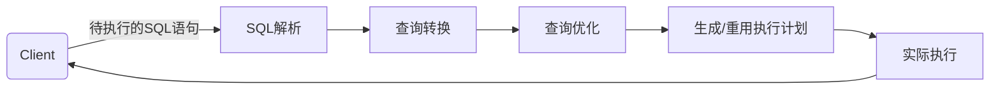

Oracle查询转换之子查询展开

# 查询转换的作用
Oracle里的查询转换（Query Transformation），又被称为查询改写（Query Rewrite），是指Oracle在解析目标SQL时可能会对其进行**等价改写**，目的是为了能更加高效地执行目标SQL，即Oracle可能会将目标SQL改写成语义上完全等价但执行效率更高的形式。



当用户提交待执行的目标SQL后，Oracle首先会执行对目标SQL的解析过程。解析过程中Oracle会对目标SQL进行**语法、语义和权限**的检查。在目标SQL通过检查后，Oracle就会去库缓存中查找匹配的shared cursor。如果找到了匹配的shared cursor，Oracle就会把存储在child cursor中的解析树和执行计划直接拿过来重用（这相当于跳过了查询转换和查询优化两个步骤）。

如果找不到匹配的shared cursor，就会进入到查询转换的流程。Oracle会根据一些规则来决定是否对目标SQL进行等价改写。在Oracle 10g及其以后的版本中，Oracle会对某些类型的查询转换（比如子查询展开、复杂视图合并等）计算成本，只有等价改写SQL的成本值小于原始SQL文本的成本值时，才会执行查询转换。然后是查询优化的流程。根据不同的优化器类型，Oracle会采用不同的判断原则，从执行完查询转换后得到的多个可能的执行路径中选择一条来作为目标SQL的执行计划。

# 子查询展开
子查询展开（Subquery Unnesting）是优化器处理带子查询的目标SQL的一种优化手段。它是指优化器**将目标SQL中的子查询转化为它自身和外部查询之间等价的表连接**。这种等价表连接转换要么是将子查询拆开（即将子查询中的表、视图从子查询中拿出来，然后和外部查询中的表、视图做表连接），要么是不拆开但是会把该子查询转换为一个**内嵌视图**（Inline View），然后再和外部查询中的表、视图做表连接。

Oracle会确保子查询展开所对应的等价表连接转换的正确性，即转换后的SQL和原SQL在语义上一定是等价的。并不是所有的子查询都能做子查询展开。在Oracle 10g及其以后版本中，对于那种不拆开子查询但是会把子查询转换成一个内嵌视图的子查询展示，只有当经过子查询展开后的等价改写SQL的成本值小于原SQL的成本值时，Oracle才会对原SQL执行子查询展开。

子查询展开通常会提高SQL执行的效率，因为如果不做子查询展开，通常情况下该子查询就会在执行计划的最后一步才被执行，并且会走FILTER类型的执行计划。这种执行计划的效率通常不会太高，尤其是在子查询中包含两个或两个以上的表连接时。

Oracle数据库里子查询前的where条件如果是下面这些条件之一，那么目标SQL在满足了一定条件后就可以做子查询展开：
- SINGLE-ROW (=、<、>、<=、>=和<>)
- EXISTS
- NOT EXISTS
- IN 
- NOT IN
- ANY
- ALL

如果一个子查询前的where条件是SINGLE-ROW条件，那么该子查询至多只会返回一条记录；如果一个子查询前的where条件是除SINGLE-ROW条件之外的上述其它类型的条件，那么该子查询的返回结果就可以包含多条记录。

## Case 1: 把子查询拆开

下面三条SQL是等价的。
```sql
--SQL1
> select t1.cust_last_name,t1.cust_id
from customers t1
where t1.cust_id in (select t2.cust_id 
from sales t2
where t2.amount_sold > 700);

--SQL2
> select t1.cust_last_name,t1.cust_id
from customers t1
where t1.cust_id = any (select t2.cust_id 
from sales t2
where t2.amount_sold > 700);

--SQL3
> select t1.cust_last_name,t1.cust_id
from customers t1
where exists (select 1 
from sales t2
where t2.amount_sold > 700
and t2.cust_id=t1.cust_id);
```

如果通过添加SQL Hint使得优化器不对SQL1做子查询展开：
```sql
> set autotrace traceonly
> set timing on
> select t1.cust_last_name,t1.cust_id
from customers t1
where t1.cust_id in (select /*+ no_unnest */t2.cust_id 
from sales t2
where t2.amount_sold > 700);
已选择4739行。
已用时间：00: 00: 06.09
执行计划
...
Id | Operation                            | Name           | Rows |
 0 | SELECT STATEMENT                     |                | 1    |
*1 |  FILTER                              |                |      |
 2 |   TABLE ACCESS FULL                  | CUSTOMERS      | 55500|
 3 |   PARTITION RANGE ALL                |                | 2    |
*4 |    TABLE ACCESS BY LOCAL INDEX ROWID | SALES          | 2    |
 5 |     BITMAP CONVERSION TO ROWIDS      |                |      |
*6 |      BITMAP INDEX SINGLE VALUE       | SALES_CUST_BIX |      |

Predicate information (identified by operation id):
1 - filter (EXISTS (SELECT /*+ NO_UNNEST */ 0 FROM "SALES" "T2" 
    WHERE "T2"."CUST_ID"=:B1 AND "T2"."AMOUNT_SOLD" > 700))
4 - filter ("T2"."AMOUNT_SOLD" > 700)
6 - access ("T2"."CUST_ID"=:B1)

统计信息
------------------------------------------------------------
...
      0 db block gets
2584213 consistent gets
...
```

从上面的执行计划和谓词信息部分可以看出，子查询`select t2.cust_id from sales t2 where t2.amount_sold > 700`是在最后一步的FILTER步骤中才被执行的。CUSTOMERS全表扫描的结果集的记录数为55500，这意味着优化器要以驱动查询条件`"T2"."CUST_ID"=:B1`执行55500次子查询。这直接导致了SQL执行时长为6.09秒，耗费的逻辑读为2584213次。

去掉SQL Hint再次执行上面的SQL1：
```sql
> select t1.cust_last_name,t1.cust_id
from customers t1
where t1.cust_id in (select t2.cust_id 
from sales t2
where t2.amount_sold > 700);
已选择4739行。
已用时间：00: 00: 00.29
执行计划
...
Id | Operation                  | Name           | Rows |
 0 | SELECT STATEMENT           |                | 7059 |
*1 |  HASH JOIN SEMI            |                | 7059 |
 2 |   TABLE ACCESS FULL        | CUSTOMERS      | 55500|
 3 |   PARTITION RANGE ALL      |                | 560K |
*4 |    TABLE ACCESS FULL       | SALES          | 560K |

Predicate information (identified by operation id):
1 - access ("T1"."CUST_ID"="T2"."CUST_ID")
4 - filter ("T2"."AMOUNT_SOLD" > 700)

统计信息
------------------------------------------------------------
...
      0 db block gets
  6493 consistent gets
...
```
从上面的执行计划和谓词信息部分可以看出，子查询部分被拆开了，子查询中的表SALES被拿出来和外部查询中的表CUSTOMERS做了哈希半连接。上面的子查询展开后，只需要对SALES做一次全表扫描，而不需要像前面那样走位图索引`SALES_CUST_BIX`去访问SALES表55500次。目标SQL的执行时间降到了0.29秒，耗费的逻辑读也降到了6493次。

>:fish:半连接 & 反连接
> 1. 当做子查询展开时，Oracle经常会把那些外部where条件为EXISTS、IN或者`= ANY`的子查询转换为对应的**半连接**。如果连接字段上的值不存在重复的情况，也可以改写为等价的内连接条件。
> 2. 当做子查询展开时，Oracle经常会把那些外部where条件为NOT EXISTS、NOT IN或者`<> ANY`的子查询转换为对应的**反连接**。

## Case 2: 把子查询转换为内嵌视图

考虑下面的SQL语句：
```sql
> select t1.cust_last_name,t1.cust_id
from customers t1
where t1.cust_id in (select t2.cust_id 
from sales t2, products t3
where t2.prod_id = t3.prod_id 
and t2.amount_sold > 700);
已选择4739行。
已用时间：00: 00: 00.40
执行计划
...
Id | Operation                | Name        | Rows |
 0 | SELECT STATEMENT         |             | 7059 |
*1 |  HASH JOIN SEMI          |             | 7059 |
 2 |   TABLE ACCESS FULL      | CUSTOMERS   | 55500|
 3 |   VIEW                   | VM_NSO_1    | 560K |
*4 |    HASH JOIN             |             | 560K |
 5 |     INDEX FULL SCAN      | PRODUCTS_PK | 72   |
 6 |     PARTITION RANGE ALL  |             | 560K |
*7 |      TABLE ACCESS FULL   | SALES       | 560K |

Predicate information (identified by operation id):
1 - access ("T1"."CUST_ID"="CUST_ID")
4 - access ("T2"."PROD_ID"="T3"."PROD_ID")
7 - filter ("T2"."AMOUNT_SOLD" > 700)
```
从上面的执行计划可以看出，子查询`select t2.cust_id from sales t2, products t3 where t2.prod_id = t3.prod_id and t2.amount_sold > 700`中的表SALES和表PRODUCTS通过做哈希连接被转化为了一个内嵌视图`VM_NSO_1`，然后再和外部查询中的表CUSTOMERS做了哈希半连接。

****

:gun:子查询能否做子查询展开取决于以下两个条件：

- 子查询展开所对应的等价改写SQL和原SQL在语义上一定是要**完全等价**的。
- 对于不拆开子查询但是会把它转换为一个内嵌视图的子查询展开，只有当子查询展开后的等价改写SQL的**成本值**小于原SQL时，Oracle才会对目标SQL进行子查询展开。

对于子查询展开的第一种情形（子查询拆开），即使是在Oracle 10g及其以后的版本中，Oracle也**不**会考虑子查询展开的成本，即Oracle会认为这种情形下子查询展开的效率始终会比不展开的效率更高。这意味着，如果目标SQL满足子查询展开的第一种情形，Oracle就会**始终**对其做子查询展开，而不会考虑子查询展开后的等价改写SQL的成本值是否小于原SQL。


