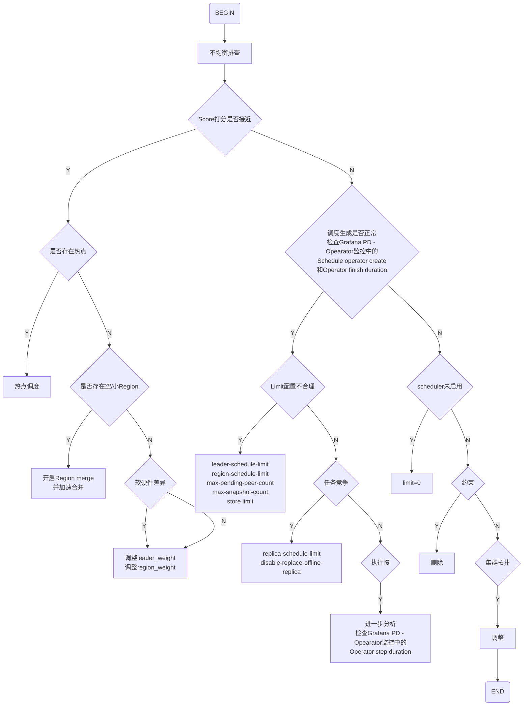
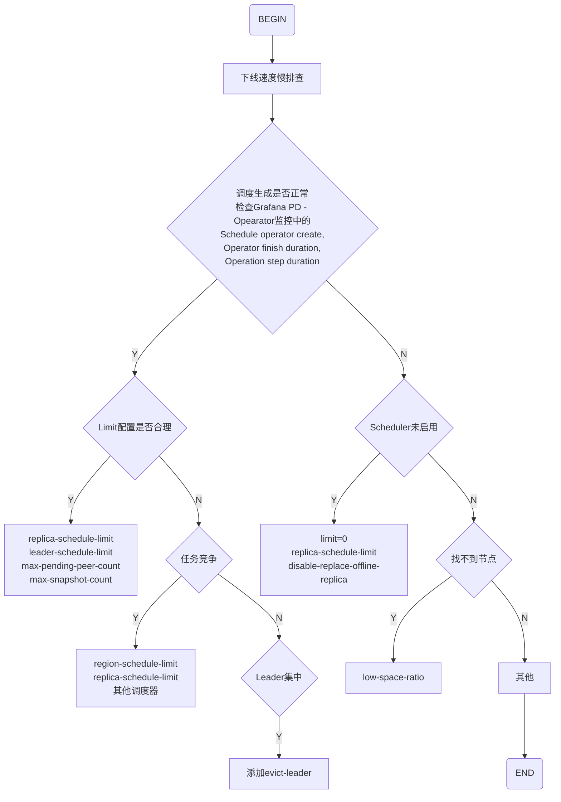
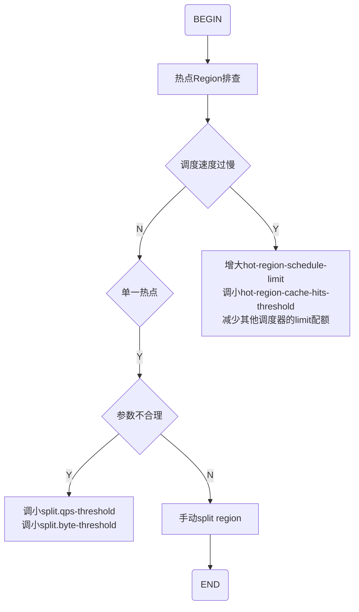
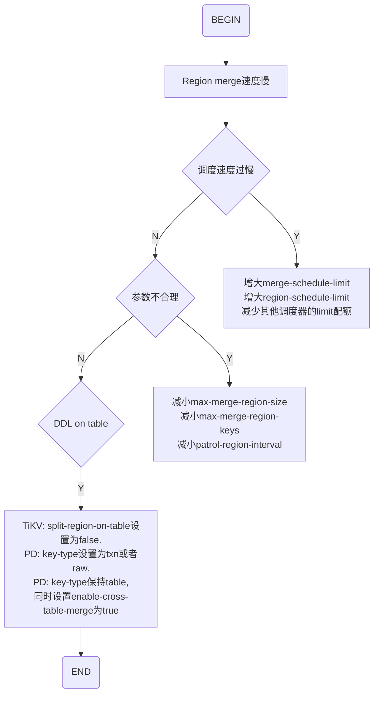

@[TOC](PD调度常见问题诊断与处理)

# Leader/Region分布不均衡
## 监控与现象
**Grafana PD/Statistics - Balance**页面展示了负载均衡的相关统计，包括Store region/leader score、Store region/leader size、Store region/leader count。

此外，也可以使用pd-ctl的store命令查询Store的得分、数量、剩余空间和weight等信息。

有分布不均衡问题时，不同的TiKV节点（Store）的Store region/leader score、Store region/leader size、Store region/leader count会出现较大的差异。

## 排查处理流程
一般的排查思路如下：


PD的打分机制决定了一般情况下，不同Store的Leader Count和Region Count不能完全说明负载均衡状态，所以需要从TiKV的实际负载或者存储空间占用来判断是否有负载不均衡的状况。

确认Leader/Region分布不均衡后，首先观察不同Store的打分情况。

如果不同Store的打分是接近的，说明PD认为此时已经是均衡状态了，可能的原因有：

- 存在热点导致负载不均衡。可以参考热点分布不均匀中的解决办法进行分析处理。
- 存在大量空Region或小Region，因此不同Store的Leader数量差别特别大，导致Raftstore负担过重。此时需要开启Region Merge并尽可能加速合并。
- 不同Store的软硬件环境存在差异。可以酌情调整`leader-weight`和`region-weight`来控制Leader/Region的分布。
- 其他不明原因。仍可以通过调整`leader-weight`和`region-weight`来控制Leader/Region的分布。

如果不同Store的分数差异较大，需要进一步检查Operator的相关Metrics，特别关注Operator的生成和执行情况，这时大体上又分两种情况：

1. 生成的调度是正常的，但是调度的速度很慢。可能的原因有：

- 调度速度受限于limit配置。PD默认配置的limit比较保守，在不对正常业务造成显著影响的前提下，可以酌情将`leader-schedule-limit`或`region-schedule-limit`调大一些。此外，`max-pending-peer-count`以及`max-snapshot-count`限制也可以放宽。
- 系统中同时运行有其他的调度任务产生竞争，导致balance速度上不去。这种情况下如果balance调度的优先级更高，可以先停掉其他的调度或者限制其他调度的速度。例如Region没均衡的情况下做下线节点操作，下线的调度与Region Balance会抢占`region-schedule-limit`配额，此时你可以调小`replica-schedule-limit`以限制下线调度的速度，或者设置`enable-replace-offline-replica = false`来暂时关闭下线流程。
- 调度执行得太慢。可以通过Operator step duration进行判断。通常不涉及到收发Snapshot的Step（比如TransferLeader，RemovePeer，PromoteLearner等）的完成时间应该在毫秒级，涉及到Snapshot的Step（如 AddLearner，AddPeer等）的完成时间为数十秒。如果耗时明显过高，可能是TiKV压力过大或者网络等方面的瓶颈导致的，需要具体情况具体分析。

2. 没能生成对应的 balance 调度。可能的原因有：

- 调度器未被启用。比如对应的Scheduler被删除了，或者limit被设置为0。
- 由于其他约束无法进行调度。比如系统中有`evict-leader-scheduler`，此时无法把Leader迁移至对应的Store。再比如设置了Label property，也会导致部分Store不接受Leader。
- 集群拓扑的限制导致无法均衡。比如3副本3数据中心的集群，由于副本隔离的限制，每个Region的3个副本都分别分布在不同的数据中心，假如这3个数据中心的Store数不一样，最后调度就会收敛在每个数据中心均衡，但是全局不均衡的状态。

## 约束案例
集群有配置**evict-leader-scheduler**（驱逐某个节点的所有leader）时，此时无法把Leader迁移至对应的Store。

可以在**Grafana PD - Scheduler - Scheduler is running**监控中排查。

处理步骤如下：

1. 使用`pd-ctl config show all`确认存在evict leader的TiKV节点；
2. 使用pd-ctl取消掉该TiKV节点上的leader驱逐调度。


# TiKV节点下线速度慢
## 监控与现象
TiKV节点下线慢时，**Grafana PD - Statistics - Balance**监控中的Store leader count & Store region count长时间无变化或者下降缓慢。

也可以通过下面的命令查看Store的leader count和region count：
```bash
pd-ctl store {target_store_id}
```

## 排查处理流程
排查处理流程如下：


这个场景需要从Operator相关的Metrics入手，分析Operator的生成执行情况。

1. 如果调度在正常生成，只是速度很慢，可能的原因有：

- 调度速度受限于limit配置。可以适当调大`replica-schedule-limit`，`max-pending-peer-count`以及`max-snapshot-count`限制也可以放宽。
- 系统中同时运行有其他的调度任务产生竞争。处理方法参考Leader/Region分布不均衡。
- 下线单个节点时，由于待操作的Region有很大一部分（3副本配置下约1/3）的Leader都集中在下线的节点上，下线速度会受限于这个单点生成Snapshot的速度。你可以通过手动给该节点添加一个`evict-leader-scheduler`调度器迁走Leader来加速。

2. 如果没有对应的Operator调度生成，可能的原因有：

- 下线调度被关闭，或者`replica-schedule-limit`被设为0。
- 找不到节点来转移Region。例如相同Label的替代节点可用容量都不足20%，PD为了避免爆盘的风险会停止调度。这种情况需要添加更多节点，或者删除一些数据释放空间。

# TiKV节点上线速度慢
## 监控与现象
TiKV节点上线慢时，**Grafana PD - Statistics - Balance**监控中的Store leader count & Store region count长时间无变化或者上升缓慢。

也可以通过下面的命令查看Store的leader count和region count：
```bash
pd-ctl store {target_store_id}
```

## 排查处理流程
目前PD没有对节点上线特殊处理。节点上线实际上是依靠balance region机制来调度的，所以参考Leader/Region分布不均衡中的排查步骤即可。

# 热点Region分布不均匀
## 监控与现象
1. 写热点：

**Grafana PD - Statistics - Hot write**中查看以下监控:
- Total written bytes on hot leader regions：每个TiKV实例上所有成为写入热点的leader的总的写入流量大小；
- Total written bytes on hot peer regions：每个TiKV实例上所有成为写入热点的peer的写入流量大小；
- Store write rate keys：每个TiKV实例总的写入keys；
- Store write rate bytes：每个TiKV实例总的写入的流量；
- Hot region's leader distribution：每个TiKV实例上成为写入热点的leader的数量。

2. 读热点：

**Grafana PD - Statistics - Hot read**中查看以下监控:
- Hot Region's peer distribution：每个TiKV实例上成为读取热点的peer的数量；
- Total read bytes on hot peer Regions：每个TiKV实例上所有成为读取热点的peer的总的读取流量大小；
- Store read rate bytes：每个TiKV实例总的读取的流量；
- Store read rate keys：每个TiKV实例总的读取keys。

## 排查处理流程
排查处理流程如下：


热点调度的问题大体上可以分为以下几种情况：

- 从PD的Metrics能看出来有不少hot Region，但是调度速度跟不上，不能及时地把热点Region分散开来。
**解决方法**：调大`hot-region-schedule-limit`并减少其他调度器的limit配额，从而加快热点调度的速度。还可调小`hot-region-cache-hits-threshold`使PD对更快响应流量的变化。

- 单一Region形成热点，比如大量请求频繁scan一个小表，这个可以从业务角度或者Metrics统计的热点信息看出来。由于单Region热点现阶段无法使用打散的手段来消除，需要确认热点Region后手动添加split-region调度将这样的Region拆开。

- 从PD的统计来看没有热点，但是从TiKV的相关Metrics可以看出部分节点负载明显高于其他节点，成为整个系统的瓶颈。这是因为目前PD统计热点Region的维度比较单一，仅针对流量进行分析，在某些场景下无法准确定位热点。例如部分Region有大量的点查请求，从流量上来看并不显著，但是过高的QPS导致关键模块达到瓶颈。
**解决方法**：首先从业务层面确定形成热点的table，然后添加`scatter-range-scheduler`调度器使这个table的所有Region均匀分布。

# Region Merge速度慢
## 监控与现象
**Grafana PD - Region health**中`empty-region-count`的下降速度慢或者长时间没有变化。

## 排查处理流程
排查处理流程如下：


Region Merge速度慢也很有可能是受到limit配置的限制（`merge-schedule-limit`及 `region-schedule-limit`），或者是与其他调度器产生了竞争。具体来说，可有如下处理方式：

1. 假如已经从相关Metrics得知系统中有大量的空Region，这时可以通过把`max-merge-region-size`和`max-merge-region-keys`调整为较小值来加快Merge速度。这是因为Merge的过程涉及到副本迁移，所以Merge的Region越小，速度就越快。如果生成Merge Operator的速度很快，想进一步加快Region Merge过程，还可以把`patrol-region-interval`调整为 "10ms" (从v5.3.0起，此配置项默认值为**10ms**)，这个能加快巡检Region的速度，但是会消耗更多的CPU资源。

2. 创建过大量表后（包括执行Truncate Table操作）又清空了。此时如果开启了**split table**特性，这些空Region是无法合并的，此时需要调整以下参数关闭这个特性：

- TiKV: 将`split-region-on-table`设为false，该参数不支持动态修改。

- PD: 使用PD Control，根据集群情况选择性地设置以下参数。

  - 如果集群中不存在TiDB实例，将key-type的值设置为`raw`或`txn`。此时，无论`enable-cross-table-merge`设置如何，PD均可以跨表合并Region。该参数支持动态修改。
  ```bash
  config set key-type txn
  ```
  - 如果集群中存在TiDB实例，将key-type的值设置为`table`。此时将`enable-cross-table-merge`设置为 **true**，可以使PD跨表合并Region。该参数支持动态修改。
  ```bash
  config set enable-cross-table-merge true
  ```

3. 对于3.0.4和2.1.16以前的版本，Region中Key的个数 (approximate_keys) 在特定情况下（大部分发生在删表之后）统计不准确，造成keys的统计值很大，无法满足`max-merge-region-keys`的约束。你可以通过调大`max-merge-region-keys`来避免这个问题。


**References**
【1】[典型场景分析与处理](https://docs.pingcap.com/zh/tidb/stable/pd-scheduling-best-practices#%E5%85%B8%E5%9E%8B%E5%9C%BA%E6%99%AF%E5%88%86%E6%9E%90%E4%B8%8E%E5%A4%84%E7%90%86)
【2】[PD重要监控指标](https://docs.pingcap.com/zh/tidb/stable/grafana-pd-dashboard#statistics---hot-write)


