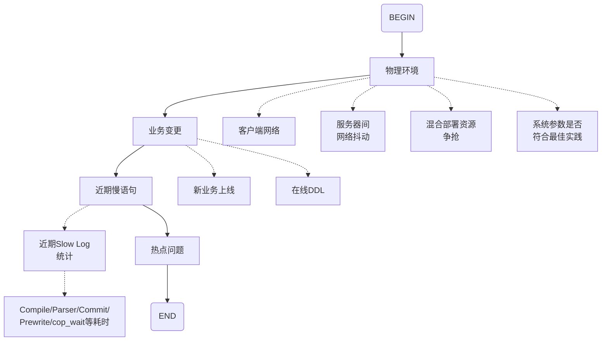
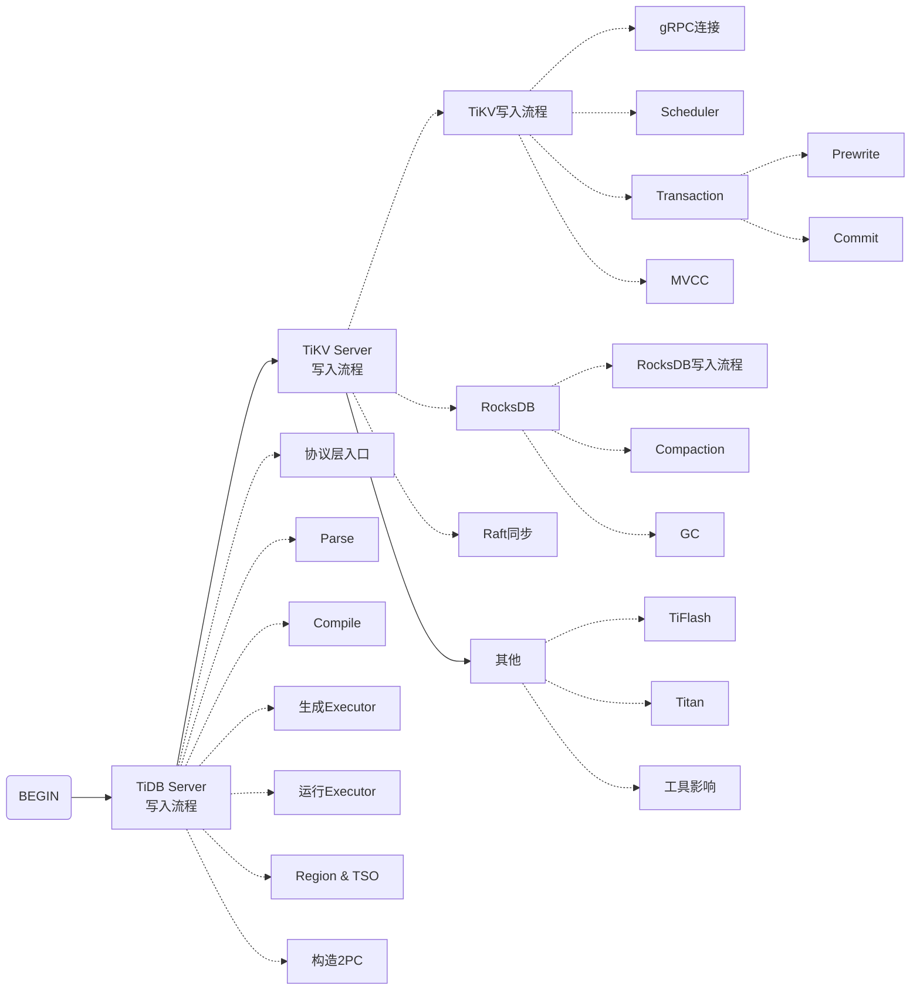

@[TOC](TiDB数据库写入慢排查分析)

# TiDB写入流程简述
TiDB写请求通过**gRPC模块**发送给TiKV实例。TiKV上的**Scheduler模块**负责写请求的流量控制、Latch冲突检测、Snapshot对比。

- **流量控制**：Scheduler模块会对写请求进行流量判断，如果接收的写请求太多，会返回*Scheduler too Busy*的错误。
- **Latch冲突检测**：在事务模式下，为了防止多个写请求同时写一个Key，Scheduler模块会在内存中生一个Latch锁。只有获得了Latch的写请求才能继续下一步操作，其余的写请求都处于等待队列中。
- **Snapshot对比**：在某个写请求获取到Latch后，Scheduler会检测该写请求要修改的数据版本是否已经被之前的其他事务修改了。

Scheduler模块处理之后所有涉及写的流程称之为**Async Write**。

Scheduler首先把写请求发送给**Raftstore模块**。Raftstore模块主要有以下作用：

- **Propose**：把写请求转化为**Raft Log**；
- **Append Log**：将Raft Log写到本地的RocksDB Raft实例中；
- **Replicate**：将Raft Log发送到同一Raft协议组的其他Follower Regions；
- **Commit Log**：在收到多数派返回的成功消息后，提交Raft Log。

Raft Log提交以后，其中的数据会被转化为KV键值对持久化到RocksDB KV实例，这一过程叫做Apply，由**Async Apply模块**完成。Async Apply又可以分为以下两个过程：

- **Apply wait**：队列繁忙时，等待KV数据转化的过程；
- **Apply**：真正转化KV数据并且持久化的过程。

下图展示了TiDB写入流程中涉及的三个线程池以及对应的Grafana监控。

# 写入慢排查思路
通过现象确定排查方向：

1. 典型方向：
- 物理环境导致写入慢
- 业务变更（比如DDL）
- 慢查询语句
- 写入热点问题

2. 复杂问题：对照TiDB写入流程进行排查

## 典型问题排查
典型问题排查可以参考以下流程：

## 复杂问题排查
复杂问题排查思路如下：

## Grafana监控写延时分析
### 延迟定位
排查延迟duration时，重点关注三个监控：
- **Grafana监控TiDB - Query Summary - Duration**
可以查看整个TiDB集群的所有SQL的平均响应时间。包含了在TiDB Server处理、TiDB Server与TiKV之间的网络传输耗时、以及TiKV处理请求的总耗时。
- **Grafana监控TiDB - KV Request - KV Request Duration 99 By Store/Type**
包含了TiDB Server与TiKV之间的网络传输耗时、以及TiKV处理请求的总耗时。
- **Grafana监控TiKV-Details - gRPC - 99% gRPC message duration**
包含了不同类型请求在TiKV端处理的总耗时。

### TiKV写请求处理耗时分析
TiKV节点的耗时分析需要关注以下监控：
- **Grafana监控TiKV-Details - Scheduler prewrite - Scheduler command duration**
包含了写请求中latch wait的时间、async snapshot、以及async write的总耗时。
- **Grafana监控TiKV-Details - Scheduler prewrite - Scheduler latch wait duration**
包含了写请求中latch wait的总耗时。
- **Grafana监控TiKV-Details - Storage - Storage async write duration**
包含了Raft Log的Propose、Append、Apply等流程的总耗时。

### Async Write耗时分析
Async write耗时包括以下五个部分：
- **Grafana监控TiKV-Details - Raft Propose - Propose wait duration per server**
Raft日志Propose阶段的总耗时。
- **Grafana监控TiKV-Details - Raft IO - Append log duration**
Raft日志持久化到本地RocksDB Raft过程的总耗时。
- **Grafana监控TiKV-Details - Raft IO - Commit log duration**
包括了当前TiKV节点将Raft日志落盘的时间、以及将Raft日志分发给其他节点并等待多数节点回应的时间。
- **Grafana监控TiKV-Details - Raft Propose - Apply wait duration**
Raft日志从Raft store发送到Async apply线程池，直到被真正应用之前的时间。
- **Grafana监控TiKV-Details - Raft IO - Apply log duration**
Raft日志被应用的总耗时。

### Raftstore pool vs Apply Pool
Raftstore线程池与Apply线程池之间的关系类似于生产者与消费者的关系。如果Raftstore线程池中的线程数（`store-pool-size`）远大于Apply线程池中的线程数（`apply-pool-size`），就可能产生写请求积压，导致apply wait duration耗时长。

