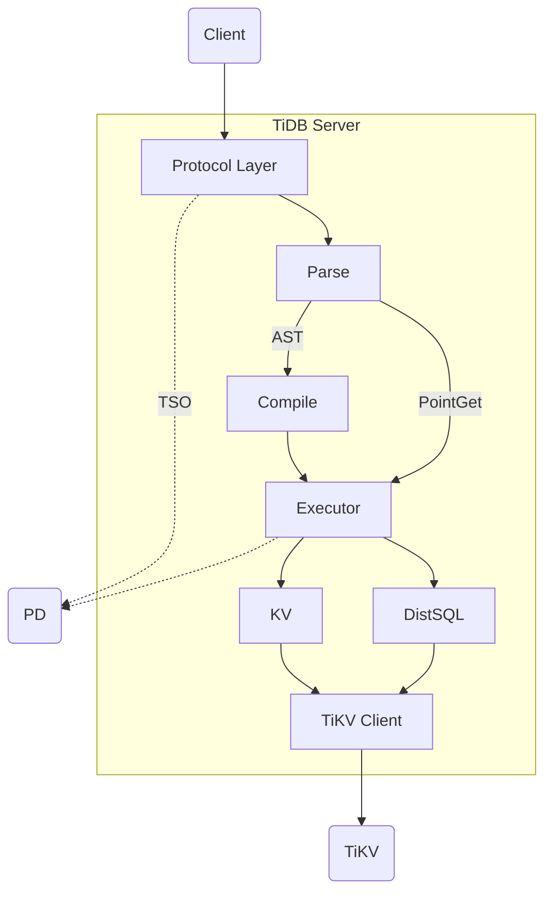
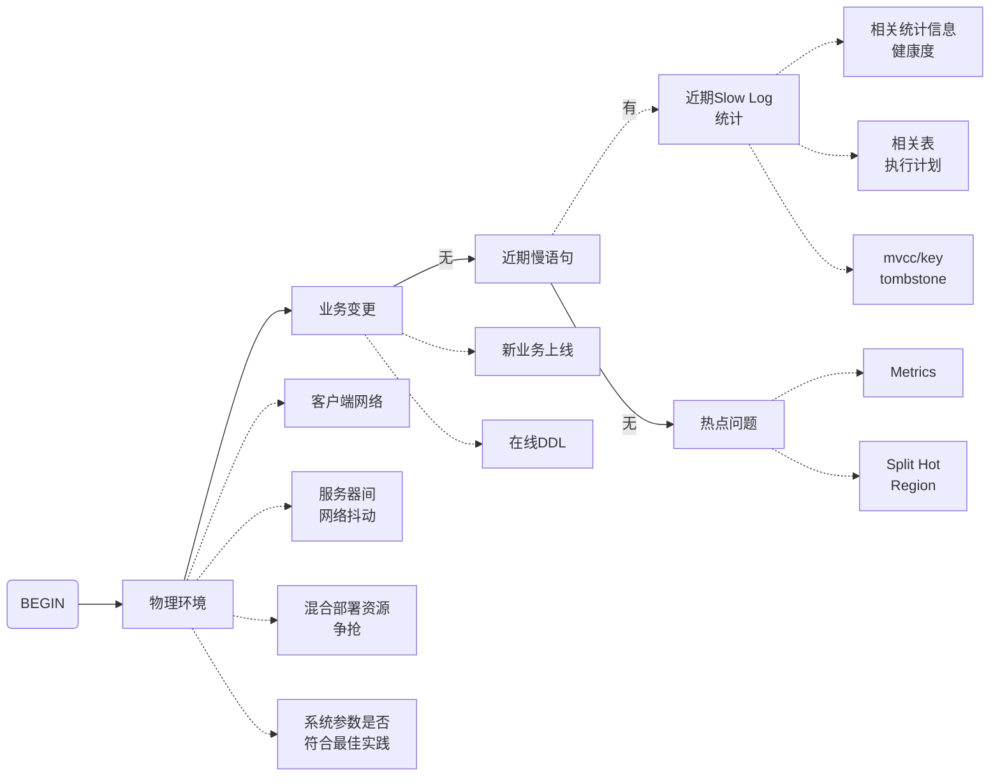
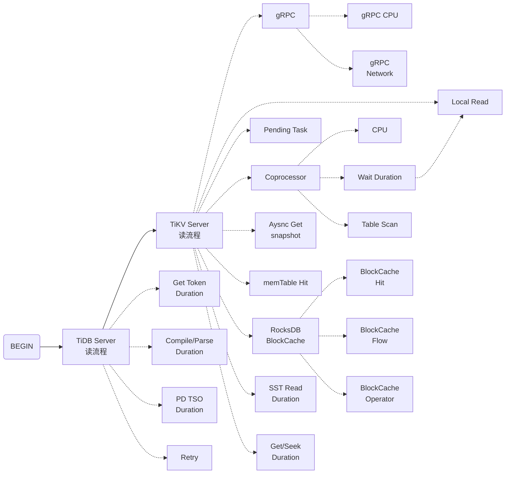

@[TOC](TiDB数据库读取慢排查分析)

# TiDB读流程简述
TiDB Server部分的读流程如下图所示：


**点查 Point Get**
点查语句经过Parse模块的词法解析和语法解析后直接到达Executor模块执行。Executor模块将读请求经由KV模块和TiKV Client发送到TiKV实例的**UnifyRead**线程池。

UnifyRead线程池会对收到的读请求划分优先级。新来的请求的优先级最高，为**L0**级别；如果某个L0级别的读请求在较长时间内没有完成，就会降级为**L1**级别；如果L1级别的读请求在较长时间内没有处理完，就会降级为**L2**级别。

读请求通过UnifyRead线程池从RocksDB KV实例查询数据时，会获取一个snapshot快照，并读取离该快照时间最近的数据版本。读请求从以下三个部分读取数据：

- **MemTable**：包括正在写的MemTable和已经写完的immutable MemTable；
- **Block cache**：缓存了最近经常被访问的数据；
- **SSTable**：到磁盘中按从新到旧的顺序读取不同Level的SSTable。

**非点查 DistSQL**
非点查语句经过Parse解析后还需要经过Compile模块处理才能到达Executor模块执行。Executor模块将读请求经由DistSQL模块和TiKV Client发送到TiKV实例的UnifyRead线程池。

非点查读请求在TiKV节点的流程与点查基本相同。

# 读取慢排查思路
通过现象确定排查方向：

- 如果是**集群整体响应变慢**，需要确定问题组件是在TiDB Server、TiKV还是PD；
- 如果是**某条SQL响应变慢**，需要定位持续出现的慢查询，可以通过TiDB Dashboard定位目标慢SQL。

## 典型问题排查
读取慢的典型问题排查可以参考以下流程：



## 复杂问题排查
结合Grafana监控排查读取慢复杂问题的思路如下：



# 案例分析
## 集群整体情况分析
首先区分是否集群整体慢还是单条SQL慢。

- 查看集群整体延迟情况：
**Grafana监控TiDB - Query Summary - Duration**
- 查看集群CPS和QPS:
**Grafana监控TiDB - Query Summary - Command Per Second**
- 查看是否有慢查询：
**Grafana监控TiDB - Query Summary - SQL Slow Query**

## 慢SQL分析
如果集群中有慢查询，可以按下面的流程进行排查：
- SQL执行计划是否发生变化；
- SQL各阶段的等待时间。

在**TiDB Dashboard**的Slow Query中，可以根据时间段筛查慢SQL，帮助定位到具体的慢查询语句、以及SQL的**digest**指纹、执行计划等信息。

执行下面的查询来获取目标慢SQL采用过的执行计划：
```sql
select plan, plan_digest, digest_text
from
information_schema.statements_summary  -- 或者 statements_summary_history
where
digest = 'xxxxxxxxxxxxxxxxx';
```

如果慢SQL近期的执行计划发生了偏差，处理方式如下：
- 重新收集目标表的统计信息；
- 参考statements_summary中该SQL的plan digest的查询结果，选择执行效率高的执行计划，采用**SQL Binding**进行绑定。

如果慢SQL近期的执行计划没有发生偏差，则需要逐一排查SQL各阶段的等待时间。

在TiDB Dashboard的**Slow Query**中，也可以查看SQL各阶段的执行时间，包括解析时间、生成执行计划用的时间、Coprocessor执行耗时，等等。与正常时段对比，即可定位SQL耗时增加发生在哪个阶段。在Coprocessor读取的子菜单中，还可以查看SQL扫描的Key的数量。

## TiKV耗时分析
如果确定了读取慢发生在TiKV，可以借助以下的Grafana监控分析TiKV耗时：

- TiKV Coprocessor扫描的延迟：
**Grafana监控 - TiDB - DistSQL - Coprocessor Seconds 999**
- TiDB Server向TiKV发起读请求后，TiKV的处理时间和TiDB/TiKV之间的网络传输延迟：
**Grafana监控 - TiDB - KV Request - KV Request Duration 99 by type**
- 读请求在TiKV端处理的总耗时（不包括网络传输耗时）：
**Grafana监控 - TiKV Details - gRPC - 99% gRPC message duration**

## Coprocessor耗时分析
如果确定读取慢不是由于网络延迟，而是发生在Coprocessor扫描阶段。可以借助以下监控进一步分析：

- 查看各TiKV实例的Unified读线程池的CPU使用率是否有差别：
**Grafana监控 - TiKV Details - Thread CPU - Unified Read Pool CPU**
- 请求被调度、获取snapshot、以及构建handler的时间总和：
**Grafana监控 - TiKV Details - Coprocessor Detail - Wait duration**
- 数据扫描的耗时（按select/index/analyze_table/analyze_index等类型区分）：
**Grafana监控 - TiKV Details - Coprocessor Detail - Handle duration**
- 数据扫描的耗时（按类型和TiKV实例区分）：
**Grafana监控 - TiKV Details - Coprocessor Detail - 95% Handle duration by store**

## 读热点排查分析
如果确定了是单个TiKV的性能瓶颈导致的读取慢，则需要排查读热点。

借助**TiDB Dashboard流量可视化**页面可以排查特定时间段的读写热点。

**Gafana监控 - PD - Statistics**中有关Hot Read的一些监控指标也可以用来排查读流量：
- Hot Region's leader distribution
- Store read rate keys
- Total read bytes on hot leader regions

## SQL扫描大量Key排查
与业务方确认目标表的数据量增长情况。

查看监控**TiKV Details - Coprocessor Details - Total Ops Details**中index scan的processed_keys的数量是否逐渐升高，并且与gRPC coprocessor duration升高的趋势基本一致。

确认是SQL的问题后，需要对SQL进行优化。

热点打散的处理办法参见文章[$\lceil$TiDB数据库热点问题诊断与处理$\rfloor$](https://blog.csdn.net/Sebastien23/article/details/124869031)。

