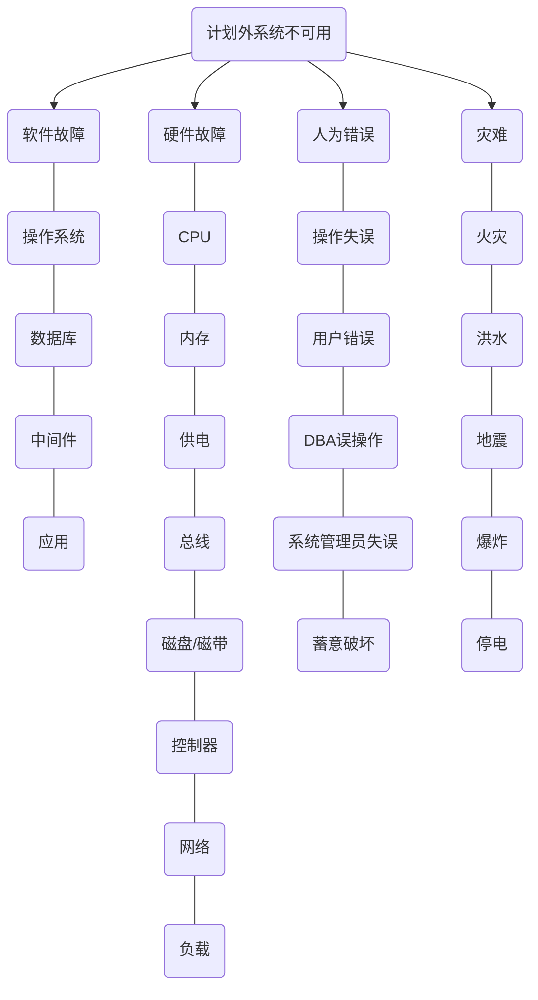
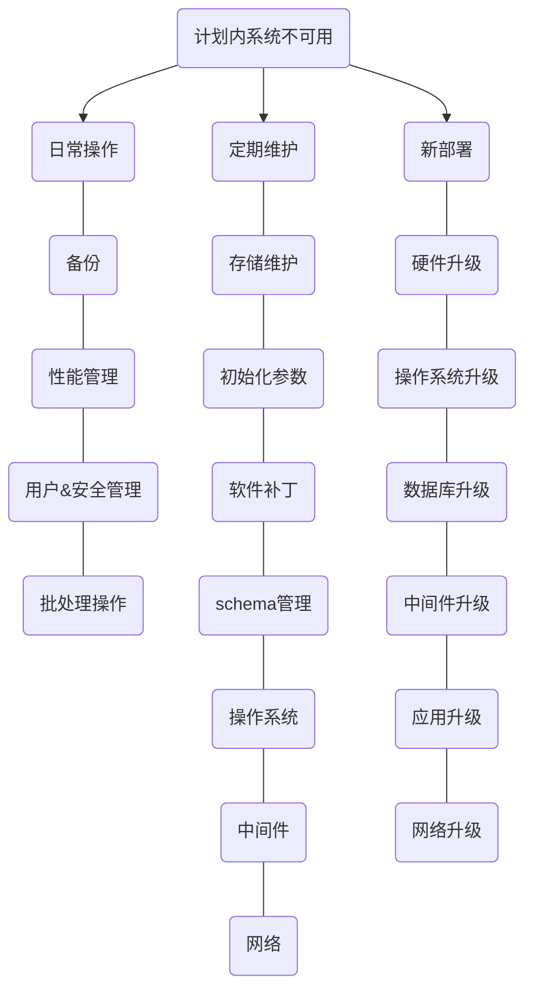
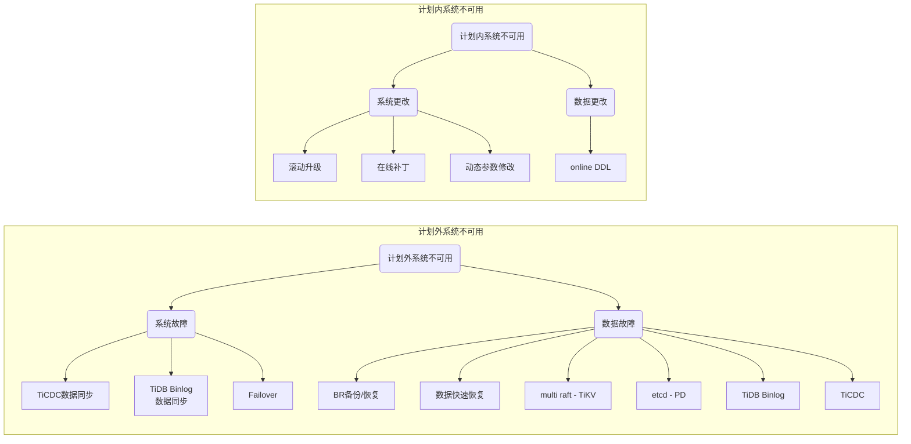

@[TOC](TiDB集群的高可用概述)

# 系统不可用
## 计划外系统不可用原因

## 计划内系统不可用原因

## TiDB系统不可用解决方案

# 高可用评判指标
## 用可提供服务的时间来评判
不可用时间，即从故障发生导致服务不可用，到服务恢复可用之间所用的时间。
| 可用性 | 年故障时间 |
| :--: | :--: |
| 99.9999% | 32秒 |
| 99.999% | 5分15秒 |
| 99.99% | 52分34秒 |
| 99.9% | 8小时46分 |
| 99% | 3天15小时36分 |

## RTO & RPO
恢复时间目标（Recovery Time Objective, **RTO**）指能够容忍的业务系统停止服务的最长时间，也就是故障发生到业务系统恢复服务所需要的最短时间。

恢复点目标（Recovery Point Objective, **RPO**）指业务系统能够容忍的数据丢失量，也就是故障发生后数据能够恢复到的最近一次备份的时间点。

# Raft与multi Raft
Leader选举：
- 通过投票产生一个节点成为Leader；
- 检查宕机、网络隔离，选举新的Leader；

Raft Log复制：
- Leader负责接收客户端请求，在本地追加日志；
- Leader将日志复制给其他节点（并覆盖不一致的日志）；

约束：
- Leader由超过一半节点投票选出；
- Raft Log需复制给一半以上节点；
- 持有最新日志的节点才能被选举为Leader。

# 组件高可用
## TiDB Server的高可用特性
- 无状态：
  - 数据由TiKV存储；
  - TiDB之间不通信（通过TiKV和PD）；
  - 随时增加和删除；
- 本身不支持Failover，需要业务支持。

## TiKV的高可用特性
故障恢复：
- 少数Follower故障或隔离不影响Leader服务；
- Leader故障或隔离后，Follower心跳超时会自动开始选举流程；
- 只要有一半以上节点存活，一定能选出新的Leader，恢复服务；

数据一致性：
- 写入数据时，Leader会保证数据被复制到大多数节点；
- 当一部分节点故障或隔离后，只要有一半以上节点存活，其中至少有一个节点包含最新的日志；
- Raft协议总是会选择包含最新日志的节点作为Leader；
- 综上所述，符合约束，就不会发生数据丢失。

## PD的高可用特性
- Leader节点提供所有服务，Follower为standby状态；
- 依赖于内嵌etcd实现leader选举；
- 一致性的要求：
  - 分配严格单调递增的时间戳；
  - 同一时刻只能有一个leader。

# CAP理论与TiDB
CAP理论指的是一个**分布式系统**最多只能同时满足一致性（*Consistency*）、可用性（*Availability*）和分区容错性（*Partition tolerance*）中的**两项**特性。

- **一致性**：所有节点在同一时间的数据完全一致；
- **可用性**：读写服务一直可用，而且是正常响应时间；
- **分区容错性**：部分节点或网络分区故障时，整个系统仍然能够对外提供满足一致性**或**可用性的服务。

# TiDB数据库的高可用特性
- TiDB数据库提供强一致性；
- 如不能保证强一致性，则拒绝服务；
- 在PD和TiKV至少存活半数以上副本的情况下，容忍一定限度内的节点宕机和网络隔离；
- PD和TiKV可以自动故障转移至存活的大多数副本；
- TiDB Server不保证所有节点同时提供服务；
- 故障解决会伴随有服务的降级（TiKV节点故障会导致整体计算和存储能力降低）。

